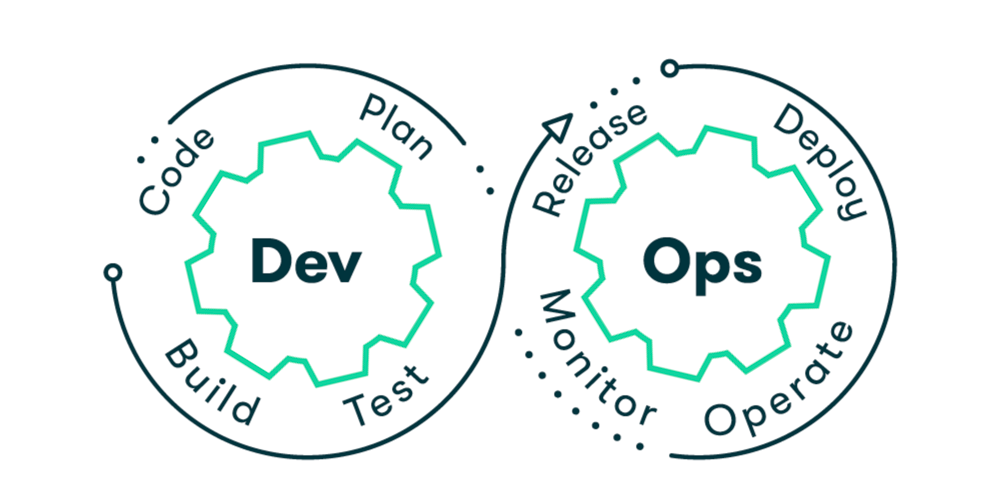

<h1 align="center">Hi, I'm Adarsh Malshetty</h1>

<h3 align="center">
DevOps Engineer II | Cloud-Native Platforms • Kubernetes • GCP • Automation
</h3>

  

---

## About Me

I am a **DevOps Engineer II** with **2+ years of hands-on production experience**, focused on building, operating, and scaling **cloud-native platforms** on **Google Cloud Platform (GCP)**.

My work centers around **Kubernetes-based microservices**, **CI/CD automation**, and **Python-driven operational tooling**, supporting **multi-tenant enterprise systems** with strict uptime and reliability requirements.

In parallel with enterprise production work, I actively build **self-hosted and experimental infrastructure projects** to deepen my understanding of systems, networking, security, and platform design.

📍 Hyderabad, India  
📧 **adishetty224@gmail.com**  
💼 [LinkedIn](https://www.linkedin.com/in/adarshmalshetty)  
💻 [GitHub](https://github.com/AdarshMalshetty)

---

## What I Work On

  

- Cloud-Native Platform Engineering (GCP)
- Kubernetes & Helm (multi-environment, multi-client)
- CI/CD Pipelines (Jenkins, GitHub Actions)
- Python-based Operational Automation
- Infrastructure as Code (Terraform, Ansible)
- Monitoring, Logging & Root Cause Analysis
- **Self-Hosted Infrastructure & Systems Engineering**

---

## Key Impact

- Reduced deployment time by **~80%** through Python automation and Helm-based orchestration
- Maintained **99%+ uptime** across production microservices
- Managed **50+ environments** for **7 enterprise retail clients**
- Built and customized Helm charts for new and existing services
- Resolved **500+ production and support incidents annually**

---

## Tech Stack

### Languages
Python • Java • Bash • YAML

### Cloud & Containers
Google Cloud Platform (GCP) • Azure  
Docker • Kubernetes • Helm

### CI/CD & Infrastructure
Jenkins • GitHub Actions  
Terraform • Ansible

### Observability & Networking
Grafana • GCP Logging  
Kubernetes Ingress • Service Networking

---

## Featured Projects

### 🔹 Self-Hosted Home Server & Personal Cloud
A production-style home server built using **Ubuntu Server** on a virtualized host, providing secure remote file access, static networking, and a foundation for future services such as VPN access and media streaming.

**Focus areas:** Linux administration, networking, security hardening, infrastructure isolation.

---

### 🔹 Android Application Containerization Platform
A proof-of-concept platform exploring **containerized Android environments using Docker**, aimed at enabling scalable, cloud-based execution and CI/CD-friendly Android workloads.

**Focus areas:** Docker internals, Android runtime architecture, container isolation, platform design.

---

## Engineering Philosophy

I believe effective DevOps engineering requires understanding systems **end-to-end** — from hardware, networking, and operating systems to containers, orchestration, and automation.

Alongside enterprise production responsibilities, I build self-hosted and experimental platforms to:
- Validate architectural assumptions
- Understand failure modes deeply
- Design systems that are observable, secure, and extensible

These projects reflect how I think, not just the tools I use.

---

## GitHub Stats

  
  

  

---

## Connect With Me

📧 **Email:** adishetty224@gmail.com  
💼 **LinkedIn:** https://www.linkedin.com/in/adarshmalshetty  

  <i>Building scalable systems. Automating the boring. Keeping production alive.</i>

