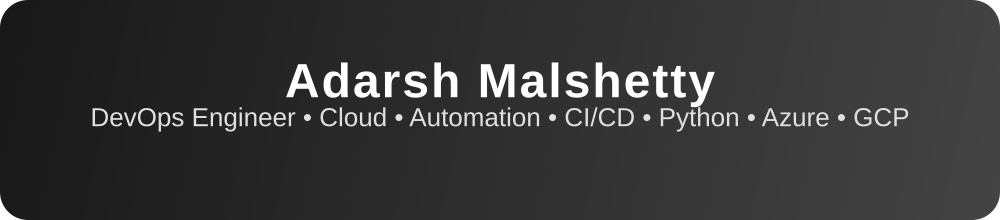
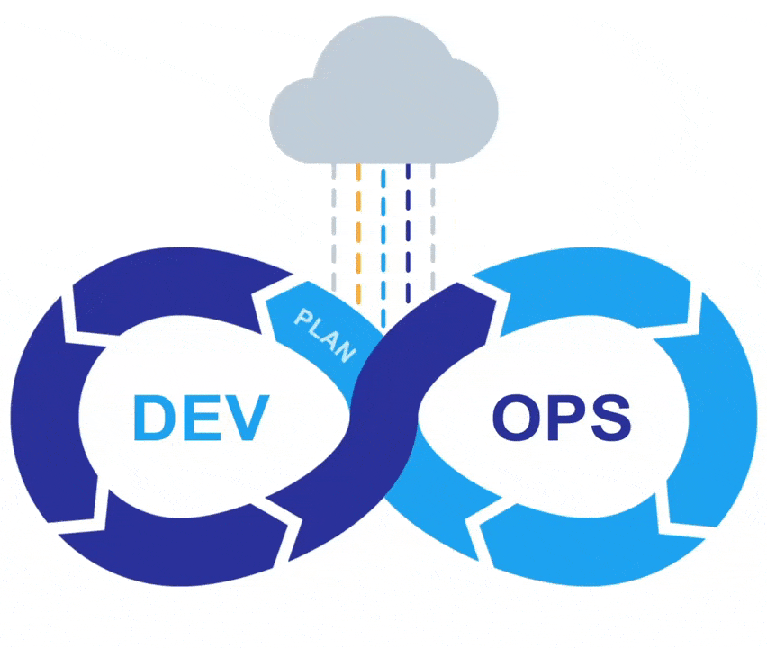
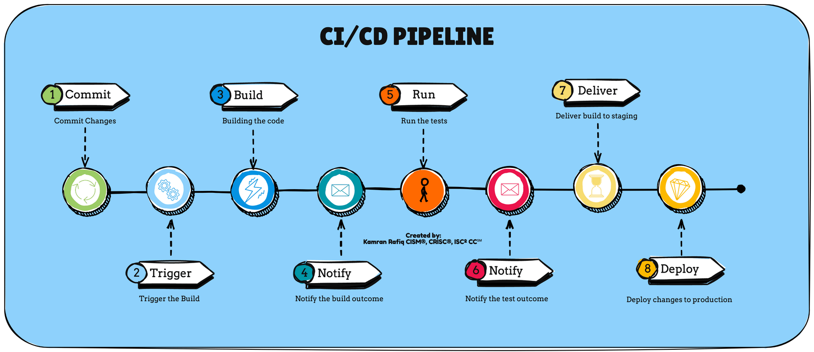

  

## Hello! I'm **Adarsh Malshetty** 👋

I'm a DevOps Engineer based in Hyderabad, passionate about building scalable cloud-native systems and automating infrastructure. I enjoy working with modern DevOps tools and cloud platforms to deliver reliable, efficient solutions. My experience spans designing CI/CD pipelines, managing Kubernetes environments, and driving automation across teams.

- 📍 Hyderabad, India  
- 📧 [adishetty224@gmail.com](mailto:adishetty224@gmail.com)  
- 💼 [LinkedIn](https://www.linkedin.com/in/adarshmalshetty)  
- 💻 [GitHub](https://github.com/AdarshMalshetty)  
- DevOps Engineer @ NCR Voyix | Computer Science, KMIT Hyderabad

  

I am passionate about automating workflows, designing scalable CI/CD pipelines, and building robust cloud-native solutions. My expertise spans DevOps, infrastructure as code, and cloud automation. I enjoy solving complex technical challenges and thrive on continuous learning.

---

### 🚀 DevOps In Action

  

---

### 🛠️ CI/CD & Workflow

  

>

---

## 🔎 Featured Projects

- [Project 1 Name](project1-link)  
- [Project 2 Name](project2-link)  
- [Project 3 Name](project3-link)  
- [Project 4 Name](project4-link)  

---

## 💡 Skills & Technologies

**Programming:**  

**Cloud/DevOps:**  

**Tools:**  

---

## 📊 GitHub Stats

  
  

  

---

## 📬 Connect with Me

- **Email:** [adarsh.malshetty@email.com](mailto:adarsh.malshetty@email.com)  
- **LinkedIn:** [linkedin.com/in/adarshmalshetty](https://www.linkedin.com/in/adarshmalshetty)

---